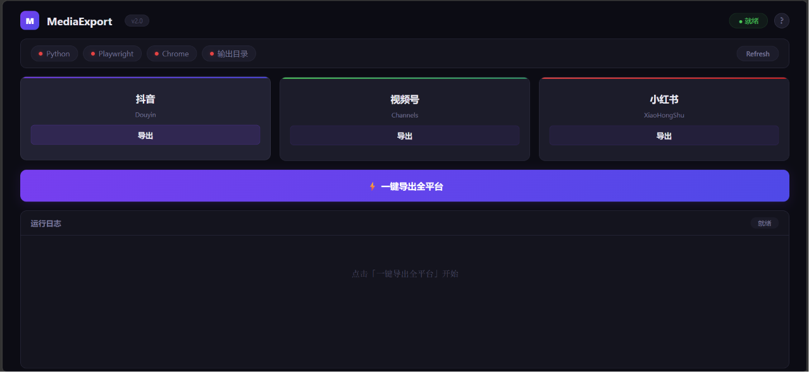



# MediaExportTool

**自媒体多平台数据导出工具 · 抖音 / 视频号 / 小红书一键导出**

---

## 📖 简介 | Introduction

MediaExportTool 是一款基于 **Playwright + Chrome CDP 协议** 的自媒体数据导出工具，支持 **抖音、视频号、小红书** 三大主流平台。

**核心特点：**
- ✅ **一键导出** — 网页控制面板，点击按钮即可导出
- ✅ **数据全面** — 播放量、粉丝画像、作品列表、内容分析等
- ✅ **登录态保持** — 首次扫码登录后自动复用，无需反复登录
- ✅ **隐私安全** — 所有数据在本地处理，不上传任何云端
- ✅ **多格式输出** — Excel (.xlsx) / CSV / JSON / TXT
- ✅ **纯本地运行** — 不依赖任何第三方 API 或服务

---

## 📸 界面预览 | UI Preview

<small>*网页控制面板，展示环境状态和导出控制（请在首次运行后添加截图）*</small>

---

## 🚀 快速开始 | Quick Start

### 新手 5 分钟上手

#### 第一步：安装 Python

> **什么是 Python？** Python 是一种编程语言，这个工具是用它写的。你只需要安装一次即可。

1. 打开 https://www.python.org/downloads/
2. 点击黄色的 **Download Python 3.12**（或更高版本）按钮
3. 运行下载的安装程序
4. **⚠️ 重要：在安装界面最下方，务必勾选 "Add Python to PATH"**（这样系统才能找到 Python）
5. 点击 "Install Now"，等待安装完成

> ✅ **验证安装**：按 Win + R，输入 cmd 回车，在黑色窗口中输入 python --version，如果显示 Python 3.xx 就说明安装成功。

#### 第二步：安装依赖

1. 按 Win + R，输入 cmd 回车打开命令行
2. 输入以下命令（一行一行执行）：

`ash
pip install playwright openpyxl
python -m playwright install chromium
`

> ⏳ 第二步会下载约 200MB 的浏览器内核文件，请保持网络畅通，耐心等待。

#### 第三步：启动工具

1. 进入本工具所在的文件夹
2. **双击 启动面板.bat**（如果杀毒软件提示，选择"允许运行"）
3. 等待几秒，浏览器会自动打开一个网页

> 如果浏览器没有自动打开，手动打开浏览器访问：**http://127.0.0.1:8766**

#### 第四步：扫码登录

在网页控制面板中，点击对应平台的 **「导出」** 按钮：

| 平台 | 第一次使用 | 之后使用 |
|------|-----------|---------|
| 🟣 抖音 | 自动打开 Chrome → 扫码登录 | 自动复用登录态 |
| 🔴 小红书 | 自动打开 Chrome → 扫码登录 | 自动复用登录态 |
| 🟢 视频号 | 自动打开 Chrome → 扫码登录 | 自动复用登录态 |

> 📌 **注意：** 登录成功后，登录信息保存在 chrome_profile/ 文件夹中。以后不需要再扫码。

#### 第五步：开始导出

登录成功后，在控制面板中：
- **单平台导出** — 点击对应平台的「导出」按钮
- **一键全平台** — 点击紫色的「一键导出全部平台」按钮
- 导出进度会实时显示在下方日志区域
- 数据文件保存在 **output/** 文件夹中

---

## 📁 目录结构 | File Structure

`
MediaExportTool/
├── config.json              ← 配置文件（Chrome 路径、端口等）
├── launcher.py              ← 启动面板（后端服务）
├── panel.html               ← 网页控制面板（前端界面）
├── 启动面板.bat             ← 一键启动脚本（双击即可运行）
├── requirements.txt         ← Python 依赖列表
├── README.md                ← 本文档
├── LICENSE                  ← 开源许可证
├── CONTRIBUTING.md          ← 贡献指南
│
├── chrome_profile/          ← (自动生成) 浏览器登录态缓存
├── output/                  ← (自动生成) 导出数据存放目录
├── downloads/               ← (自动生成) 下载临时目录
├── backup/                  ← (自动生成) 备份目录
│
└── scripts/                 ← 核心自动化脚本
    ├── tool_utils.py        ← 工具模块（路径解析、Chrome 检测）
    ├── douyin_export_all.py ← 抖音导出脚本
    ├── xhs_export_all.py    ← 小红书导出脚本
    ├── wechat_export_all.py ← 视频号导出脚本
    └── wechat/              ← 视频号子脚本
        ├── run_video_all_export.py
        ├── run_single_video_export_fresh.py
        ├── run_follower_export.py
        ├── run_source_dist_export.py
        └── run_fans_portrait_export.py
`

---

## ⚙️ 高级配置 | Configuration

编辑 config.json 可以自定义设置：

`json
{
  "version": "2.1",
  "chrome": {
    "auto_detect": true,
    "custom_path": "",              // 自定义 Chrome 路径
    "port": 9222,                   // Chrome 调试端口
    "profile_dir": "chrome_profile" // Profile 存放目录
  },
  "output": {
    "dir": "output"                 // 导出数据存放目录
  }
}
`

> 💡 **Edge 用户说明：** 工具会自动检测 Microsoft Edge，无需手动配置。

---

## 📊 支持导出的数据维度 | Export Data Types

| 平台 | 数据类型 | 格式 |
|------|---------|------|
| 🟣 **抖音** | 账号总览（7天数据） | TXT |
| | 播放量数据分析 | XLSX |
| | 作品列表 | XLSX |
| | 粉丝画像 | TXT |
| 🔴 **小红书** | 账号概览（粉丝增长） | XLSX |
| | 账号概览（互动数据） | XLSX |
| | 账号概览（发布数据） | XLSX |
| | 账号概览（观看数据） | XLSX |
| | 内容分析 | XLSX |
| | 粉丝概览 | TXT |
| 🟢 **视频号** | 全部视频数据 | CSV |
| | 单条视频详情 | CSV |
| | 关注者数据 | CSV |
| | 来源分布 | JSON/TXT |
| | 粉丝画像 | JSON/TXT |

---

## 🤖 使用 AI 编程助手运行本工具

如果您是 **AI 编程助手**（如 Cursor、Windsurf、Codex、GitHub Copilot、通义灵码 等）的用户，可以将本项目交给 AI 来帮您完成安装和运行。以下是通用的使用提示：

### 提示词模板（复制给您的 AI 助手）

`
请帮我阅读 MediaExportTool 项目的 README.md，然后：

1. 检查我电脑上是否已安装 Python（运行 python --version）
2. 如果未安装，告诉我如何在我的操作系统上安装 Python 3.10+
3. 帮我安装项目依赖（pip install -r requirements.txt）
4. 安装 Playwright 浏览器内核（python -m playwright install chromium）
5. 启动工具（运行启动面板.bat 或 python launcher.py）
6. 在浏览器中打开 http://127.0.0.1:8766

整个流程请一步步引导我完成，每步都要确认成功后再进行下一步。
`

### 各 AI 工具的使用方式

| AI 工具 | 使用方式 |
|---------|---------|
| **Cursor** | 用 Cursor 打开项目文件夹 → 在 Chat 中发送上述提示词 |
| **Windsurf** | 在 Cascade 中打开项目文件夹 → 粘贴提示词 |
| **Codex** | 拖拽项目文件夹到 Codex 窗口 → 粘贴提示词 |
| **GitHub Copilot Chat** | 在 VS Code 中打开项目 → 在 Chat 中发送提示词 |
| **通义灵码** | 在 VS Code 中打开项目 → 在对话窗口发送提示词 |
| **其他 AI 助手** | 基本同理：打开项目 → 让 AI 读取 README → 按指引操作 |

---

## ❓ 常见问题 | FAQ

**Q: 启动后网页打不开？**
A: 检查防火墙是否拦截，或手动在浏览器打开 http://127.0.0.1:8766

**Q: 提示"未检测到 Python"？**
A: 确认 Python 安装时勾选了 "Add Python to PATH"，然后重启电脑再试

**Q: 扫码登录后还是提示需要登录？**
A: 关闭所有 Chrome 窗口，重新运行 启动面板.bat

**Q: 导出到一半报错了？**
A: 通常是网络波动或平台页面更新导致的，不影响其他任务。可以在面板查看具体错误日志。

**Q: 支持 Mac 或 Linux 吗？**
A: 目前主要为 Windows 设计。Mac/Linux 用户需要手动调整 Chrome 路径配置。

**Q: 这些数据能用来做什么？**
A: 可用于自媒体运营数据分析、周报制作、内容策略优化、竞品分析等。

---

## 🤝 贡献指南 | Contributing

欢迎提交 Issue 和 Pull Request！详见 [CONTRIBUTING.md](CONTRIBUTING.md)。

### 开发环境

`ash
# 克隆仓库
git clone https://github.com/your-username/MediaExportTool.git
cd MediaExportTool

# 安装开发依赖
pip install -r requirements.txt
python -m playwright install chromium

# 启动开发模式
python launcher.py
`

---

## ⚠️ 免责声明 | Disclaimer

- 本工具仅用于**个人自媒体数据导出和分析**，请遵守各平台的服务条款
- 请勿将本工具用于任何非法用途
- 使用者需自行承担使用风险

---

## ⭐ Star History

---

**如果这个项目对你有帮助，请点一个 ⭐ Star 支持！**

